<div align="center">




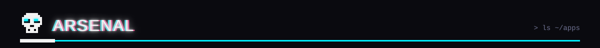
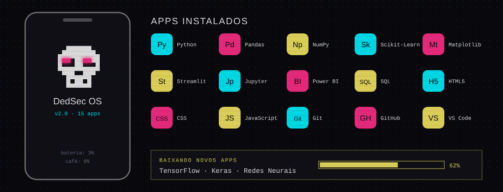

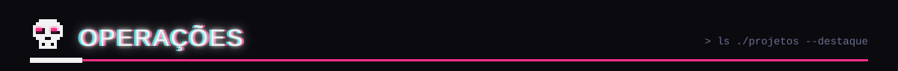

<a href="https://github.com/GS4L1M/Sa-de-Mental">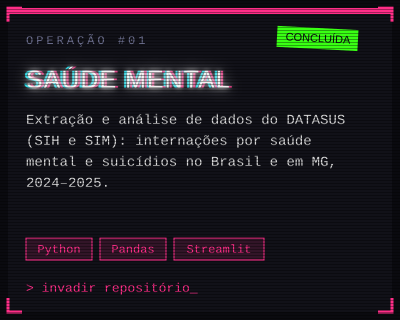</a>
<a href="https://github.com/GS4L1M/AnaliseANP">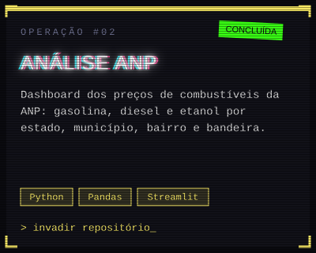</a>
<a href="https://github.com/GS4L1M/maos-a-obra-ml">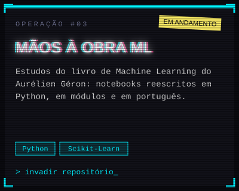</a>

</div>

<details>
<summary><b>📱 Fazer o teste de recrutamento da DedSec</b></summary>
<br>

> *"Recebemos sua solicitação. Antes de entrar, responda com sinceridade. O ctOS está observando."*

**Pergunta 1.** Você encontra uma tabela com 400 valores nulos. Você:
- 🅰 finge que não viu e faz o gráfico mesmo assim
- 🅱 descobre de onde vieram os nulos antes de tocar em qualquer coisa

**Pergunta 2.** A Blume diz que o modelo dela tem 99% de acerto. Você:
- 🅰 acredita e compartilha no LinkedIn
- 🅱 pede o conjunto de teste e procura overfitting

**Pergunta 3.** Seu código funcionou de primeira. Você:
- 🅰 comemora
- 🅱 desconfia, porque isso nunca acontece

```diff
+ Respostas B detectadas. Paranoia com dados: nível adequado.
+ Bem-vindo à DedSec. Seu primeiro trabalho: limpar os nulos.
- ctOS: acesso negado.
```

</details>

<div align="center">

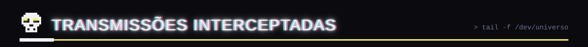

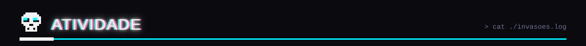


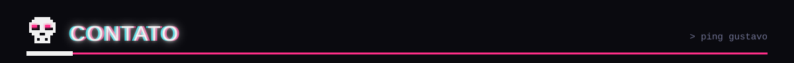

<a href="mailto:gustavosalim10@gmail.com"></a>
<a href="https://github.com/GS4L1M?tab=repositories"></a>


<sub>Tema inspirado em Watch Dogs 2. Projeto de fã, sem ligação com a Ubisoft.</sub>

</div>
