<div align="center">



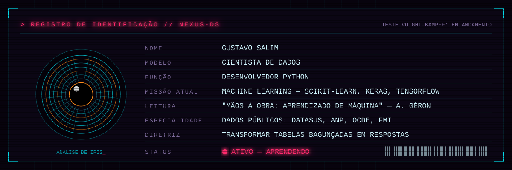

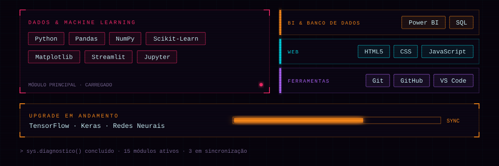


<a href="https://github.com/GS4L1M/Sa-de-Mental">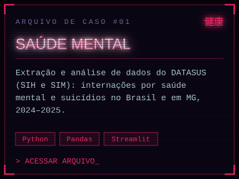</a>
<a href="https://github.com/GS4L1M/AnaliseANP">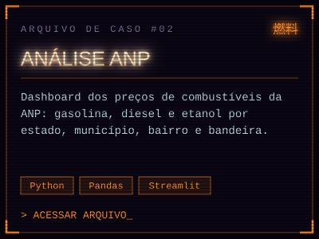</a>
<a href="https://github.com/GS4L1M/maos-a-obra-ml">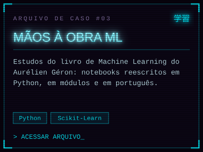</a>

</div>

<details>
<summary><b>🔴 Fazer o teste Voight-Kampff</b></summary>
<br>

> *"Reação à pergunta: tempo de resposta, dilatação da pupila, rubor involuntário..."*

**Pergunta 1.** Você recebe um dataset com 40% de valores nulos. Você:
- 🅰 apaga as linhas e segue a vida
- 🅱 investiga **por que** os dados estão faltando

**Pergunta 2.** O modelo acertou 99% no treino e 60% no teste. Você:
- 🅰 comemora os 99%
- 🅱 desconfia de overfitting e volta para os dados

**Pergunta 3.** Alguém pede "só um gráfico rapidinho". Você:
- 🅰 faz um gráfico de pizza com 14 fatias
- 🅱 pergunta qual decisão esse gráfico vai ajudar a tomar

```diff
+ Respostas B detectadas. Empatia com os dados: confirmada.
+ Resultado: humano. Provavelmente.
```

</details>

<div align="center">




<a href="mailto:gustavosalim10@gmail.com"></a>
<a href="https://github.com/GS4L1M?tab=repositories"></a>

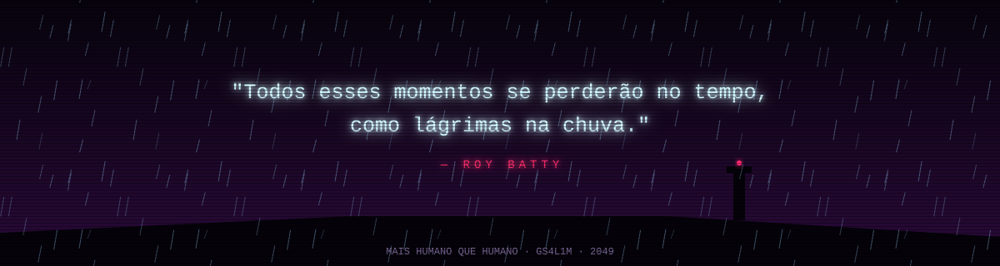

</div>
