<div align="center">


<a href="https://github.com/GS4L1M">
  
</a>

</div>

---

### `> whoami`

```diff
+ nome ............ Gustavo Salim
+ funcao .......... Cientista de Dados & Desenvolvedor Python
+ foco_atual ...... Machine Learning com Scikit-Learn, Keras & TensorFlow
+ lendo_agora ..... "Mãos à Obra: Aprendizado de Máquina" — Aurélien Géron
+ gosto_de ........ transformar dados públicos (DATASUS, ANP, OCDE) em respostas
+ contato ......... gustavosalim10@gmail.com
- colher .......... não existe 🥄
```

Eu enxergo o mundo em linhas e colunas. Tabelas grandes e bagunçadas viram análises, dashboards e modelos que respondem perguntas de verdade, como *"como estão as internações por saúde mental no Brasil?"* ou *"quanto o combustível custa no meu bairro?"*.

---

### `> ls ./habilidades`

<div align="center">

**Dados & Machine Learning**


**BI & Banco de Dados**


**Web**


**Ferramentas**


**Carregando...** `[██████░░░░] 60%`


</div>

---

### `> ls ./projetos --destaque`

<table>
  <tr>
    <td width="33%" valign="top">
      <h4>🧠 <a href="https://github.com/GS4L1M/Sa-de-Mental">Saúde Mental</a></h4>
      <p>Extração e análise de dados públicos do <b>DATASUS</b> (SIH e SIM) sobre internações por saúde mental e suicídios no Brasil e em Minas Gerais, de 2024 a 2025, com painel em Streamlit.</p>
      
      
      
    </td>
    <td width="33%" valign="top">
      <h4>⛽ <a href="https://github.com/GS4L1M/AnaliseANP">Análise ANP</a></h4>
      <p>Dashboard com os preços de combustíveis da <b>ANP</b>: gasolina, diesel e etanol por estado, município, bairro e bandeira do posto.</p>
      
      
      
    </td>
    <td width="33%" valign="top">
      <h4>🐇 <a href="https://github.com/GS4L1M/maos-a-obra-ml">Mãos à Obra ML</a></h4>
      <p>Meus estudos do livro de Machine Learning do <b>Aurélien Géron</b>: os notebooks reescritos em Python, organizados em módulos e comentados em português.</p>
      
      
      
    </td>
  </tr>
</table>

<details>
<summary><b>💊 Pílula vermelha ou pílula azul?</b></summary>
<br>

> *"Você toma a pílula azul, a história acaba, e você acorda na sua cama acreditando no que quiser. Você toma a pílula vermelha, fica no País das Maravilhas, e eu te mostro até onde vai a toca do coelho."*
> — Morpheus

🔵 **Azul:** feche esta página e siga a vida.

🔴 **Vermelha:** [entre nos meus repositórios](https://github.com/GS4L1M?tab=repositories) e descubra até onde os dados vão.

</details>

---

### `> cat ./atividade.log`

<div align="center">


</div>

---

### `> ping gustavo`

<div align="center">

<a href="mailto:gustavosalim10@gmail.com"></a>
<a href="https://github.com/GS4L1M"></a>

<br><br>



<sub><i>"Eu só posso te mostrar a porta. Você é quem tem que atravessá-la."</i></sub>

</div>
